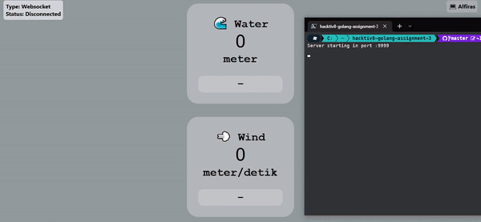

## Scalable Web Service with Golang - DTS Kominfo

# Assignment 3

Setting for server in `configs/default.go`

#### Route

`localhost: <PORT> /` (default) using websocket, [see](#websocket)

`localhost: <PORT> /polling` using polling technique, [see](#polling)

`localhost: <PORT> /long-polling` (experimental) using long polling technique, [see](#long-polling)

#### Websocket

for realtime i using [Gorilla Websocket](https://github.com/gorilla/websocket).

#### Polling

by default interval for polling data is 5 sec / 5000 ms, but you can change that, open the file in `pages/polling.html` and search for `timeout` parameter in `API` function i believe in line 310 - 317 and change to whatever value you want (but in `int` type).

#### Long Polling

because Go is very fast and the long polling technique means that the request is made immediately after the results of the previous request are completed, there will be a spike in requests that might cause the browser to slow down. i know it actually has to be some kind of server-side sleep technique, but maybe I'll update later.

but i think realtime with websocket it will be enough.
